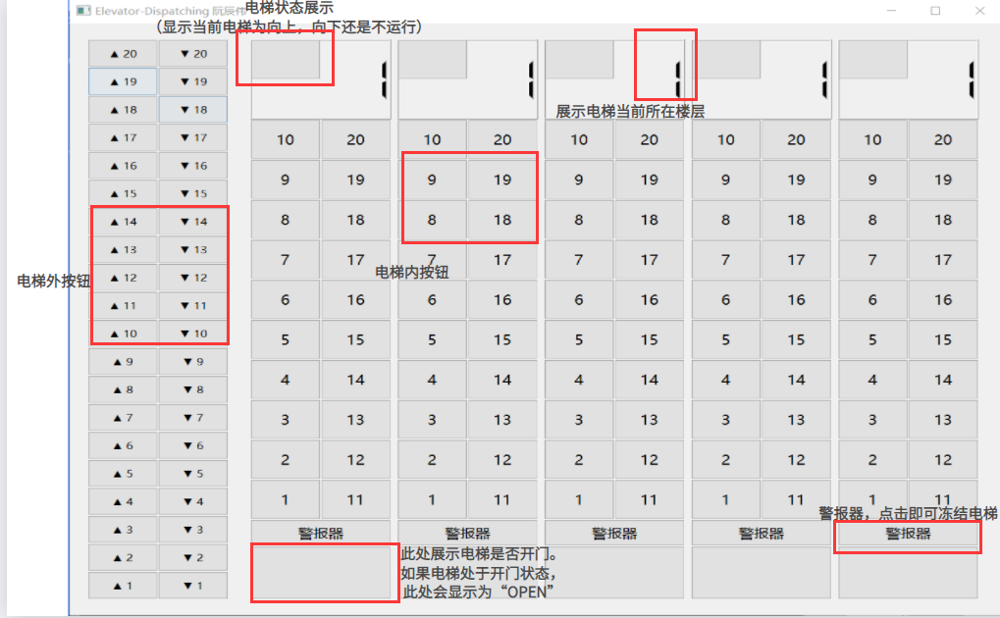
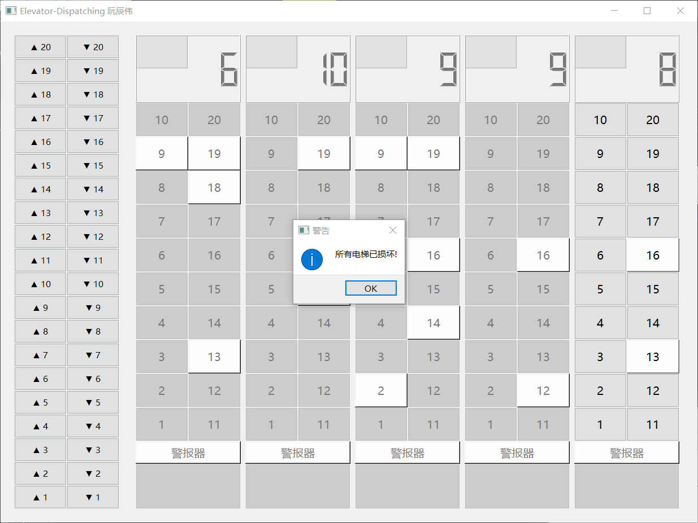

<center><h1> 电梯调度</h1></center>

<center> 1850061</center>

<center> 阮辰伟</center>

<div style="page-break-after: always;"></div>

[TOC]

<div style="page-break-after: always;"></div>

## 1. 项目介绍

### 1.1 背景

#### 1.1.1 基本任务

​		现有某一栋楼20层，内部有五个相互关联的电梯。基于线程思想，编写一个电梯调度程序。


#### 1.1.2 功能描述

- [x] 电梯应有一些按键，如：数字键、关门键、开门键、上行键、下行键、报警键等；
- [x] 有数码显示器指示当前电梯状态；
- [x] 每层楼、每部电梯门口，有上行、下行按钮、数码显示。


### 1.2 开发环境

+ 使用`python`进行开发
+ `python`版本为`3.8.2`
+ `GUI`开发使用的图形库为`pyqt5`
+ 运行：在根目录下运行如下命令（安装PyQt5和运行程序）

```bash
pip install pyqt5
python main.py
```

+ 或者运行打包好的.exe文件
+ .exe文件也许要点击过后3-4秒后才会出现，在此期间请耐心等待


## 2. 主要类及其介绍

### ElevatorInterface

​		该类主要编写了电梯GUI界面，实现了数字键、上行键、报警键等等页面元素的设计。同时，这些按键还与槽函数相连，当按动这些按钮时，ElevatorInterface中相对应的槽函数会对相应的页面进行修改。同时，槽函数还会通过其成员elevator_Manage对电梯进行调度管理。


### ElevatorManage

​		在ElevatorManage类中的elevList队列里，运行了五个彼此间有一定关联的Elevator线程，代表五个不同的电梯。ElevatorManage主要负责的工作有：

+ 当ElevatorInterface类中按下某电梯内具体到哪一层的按钮时，ElevatorManage会给这个电梯添加运行到某一楼层的任务
+ 当ElevatorInterface类中按下走廊中的电梯上下行按钮时，ElevatorManage会检查这个任务是否能被执行，并且决定这个任务被分配给哪部电梯。
+ 当ElevatorInterface类中按下某个电梯的报警器时，ElevatorManage会当即停下这个电梯当前的所有操作，并且搜索该电梯是否还有未被执行完毕的来自走廊中按钮的任务。如果存在此类任务，则会把这个任务取出来分配给别的电梯。


### Elevator

​		Elevator类描述了某部电梯在已知任务的情况下，他的调度过程。调度算法采用了LOOK调度算法。电梯的楼层状态通过一个整数elevQueue来保存，并且通过位运算的方式来获取、更改电梯状态。


## 3. 具体功能及其实现

### 3.1 单个电梯的调度

​		单个电梯调度事通过Elevator类实现的。在单个电梯的电梯调度过程中，我通过一个整数elevQueue来保存单个电梯各楼层的状态（低i为代表第i层，i为0代表没有任务，i为1代表有任务），并且通过位运算的方式来获取、更改电梯状态。这样做既可以消耗更小的空间，又能提高算法的效率。下面我将介绍一下算法中的重要变量以及重要操作。

​		这里假设二进制数最低位为低0位，次低位为低1位，以此类推。


#### 3.1.1 电梯获取任务流程

​		下面，我将通过流程图的方式来描述用户点击电梯内按钮时，电梯获取任务的流程。


#### 3.1.2 重要相关变量

以下变量均在Elevator类中

| 变量名    | 变量解释                                                     |
| --------- | ------------------------------------------------------------ |
| elev      | 电梯界面类的一个实例，可以通过它操作电梯界面                 |
| allLight  | 二进制下低20位全为1，其余位为0的数字。代表20层楼全被点亮的情况。 |
| name      | 电梯编号                                                     |
| nowFloor  | 电梯当前楼层                                                 |
| status    | 电梯当前状态。0为不运行，1为向上运动，-1为向下运动           |
| taskNum   | 电梯当前任务数量                                             |
| elevQueue | 电梯队列，二进制下低i为代表第i层，i为0代表没有任务，i为1代表有任务 |
| isIgnore  | isIgnore[i]代表电梯处于第i层且此层有任务时，是否应该忽视它转而先执行别的任务 |


#### 3.1.3 重要操作

| 操作                             | 操作解释                                                     |
| -------------------------------- | ------------------------------------------------------------ |
| elevQueue & (1 << nowFloor))     | 判断电梯第nowFloor层是否有任务，没有任务则此式值为0，反之则非0 |
| down = (1 << (nowFloor + 1)) - 1 | 使得elevQueue中nowFloor 以上的楼层全为0，nowFloor及以下的全为1 |
| elevQueue & down                 | 判断nowFloor以下楼层是否还有任务，没有任务则此式值为0，反之则非0 |
| up = down ^ allLight             | 使得elevQueue中nowFloor及以上的楼层全为1，nowFloor以下的全为0 |
| elevQueue & up                   | 判断nowFloor以上楼层是否还有任务，没有任务则此式值为0，反之则非0 |
| elevQueue ^ (1 << nowFloor)      | 删除该电梯到达第nowFloor层的任务。即把elevQueue低nowFloor位置0 |
| elevQueue + (1 << flr)           | 添加该电梯到达第nowFloor层的任务。即把elevQueue低nowFloor位置1 |


#### 3.1.4 调度算法

​		下面，我将通过流程图的方式来描述单个电梯调度的过程。


### 3.2 多个电梯的调度

​		多电梯调度相较于单电梯调度来说，所增加的内容就是用户点击走廊中按钮时，Elevator_Manage类决定把因为点击走廊而增加的任务分配给哪个电梯。当Elevator_Manage把任务分配完毕之时，接下来的程序执行便与单电梯调度的情况没了区别。所以接下来我将重点介绍Elevator_Manage分配任务的过程。


#### 3.2.1 电梯分配任务的流程

​		下面，我将通过流程图的方式来描述用户点击走廊中电梯上下行按钮时，Elevator_Manage分配任务的流程。


#### 3.2.2 重要相关变量

类Elevator_Manage中的重要相关变量

| 变量名      | 变量解释                                                    |
| ----------- | ----------------------------------------------------------- |
| elevList    | 存储了五个电梯，能够获取并更改电梯信息                      |
| outElevList | $outElevList[i][j]$代表走廊外第i层电梯的j状态是否已被点亮。 |
|             | $outElevList[i][j]$值为1代表被点亮，为0则表示未被点亮。     |
|             | 其中，j为0代表下行按键，j为1表示上升按键                    |


类Elevator中的重要相关变量

| 变量名       | 变量解释                                                     |
| ------------ | ------------------------------------------------------------ |
| isIgnore     | isIgnore[i]代表电梯处于第i层且此层有任务时，是否应该忽视它转而先执行别的任务 |
| taskNum      | 电梯的当前任务数量                                           |
| outElevQueue | outElevQueue[i]代表第i层楼是否有因为走廊按钮而分配的电梯。   |
|              | 0为没有电梯，1为上行电梯，-1为下行电梯                       |


#### 3.2.3 任务分配过程

​		下面，我将通过流程图的方式来展示Elevator_Manage分配任务的过程。


#### 3.2.4 距离的计算方法

​		在上述的任务分配过程中，最重要的过程之一就是得分score的计算，而在得分的计算过程中，对于预计距离的预估就成了重中之重。下面，我将通过图片来展示不同情况下往电梯中加入任务时电梯的预计的运行轨迹，以及距离的计算公式。

​		因为当电梯向下运动时图像与电梯向上运动时非常相似，故只绘制电梯向上运动以及电梯不运动时的情况

> 要重点注意的是，这里的距离指的是电梯从当前楼层运行到新加入的目标楼层之间的运行距离。

##### 该模块中常用变量

| 变量名       | 变量解释               |
| ------------ | ---------------------- |
| nowFloor     | 当前楼层               |
| targetFloor  | 目标楼层               |
| highestFloor | 当前可以到达的最高楼层 |
| lowestFloor  | 当前可以到达的最低楼层 |


##### 情况1：当前电梯不运动


##### 情况2：当前电梯向上运动且目标楼层按下向上按键时


##### 情况3：当前电梯向上运动且目标楼层按下向下按键时


#### 3.2.5 特殊情况说明

​		当电梯处于向上运动状态，目标楼层按下向下按键，而且$nowFloor\le targetFloor\le highestFloor$时,通过观察上方图片我们会发现当电梯第一次经过targetFloor的时候，电梯会无视该楼层继续向上运行。同理，当电梯处于向下运动状态，目标楼层按下向上按键，而且$lowestFloor\le targetFloor\le nowFloor$时同理。为了达成这个效果，在当Elevator的addOutElev函数中，如果监测搭到新增的任务符合上述两条，我们就把isIgnore列表的对应floor设置为1或者-1。调度过程中，如果发现当前楼层为需要开门的楼层时，程序会先检查isIgnore[nowFloor]是否为0。如果其不为0，则把他设置为0，并且直接执行电梯上行/电梯下降函数，无视当前的nowFloor。直到电梯到达最高点/最低点以后，才会返回执行这个任务。


### 3.3 警报器逻辑

#### 3.3.1 重要相关变量

类Elevator_Manage中

| 变量名     | 变量解释                                                     |
| ---------- | ------------------------------------------------------------ |
| freezeList | 冻结列表。freezeList[i]=0代表名字为(i+1)的电梯未被冻结，反之代表电梯被冻结了 |
| freezeNum  | 表示被冻结电梯的个数                                         |


#### 3.3.2 警报器流程图


## 4. 运行演示

### 4.1 用户界面介绍




### 4.2 实际效果展示


